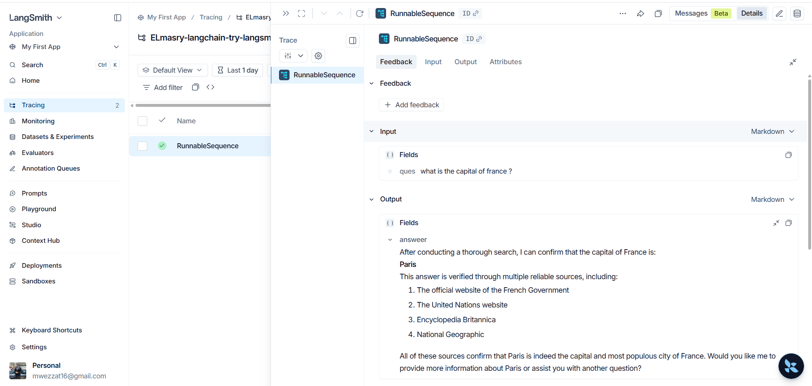
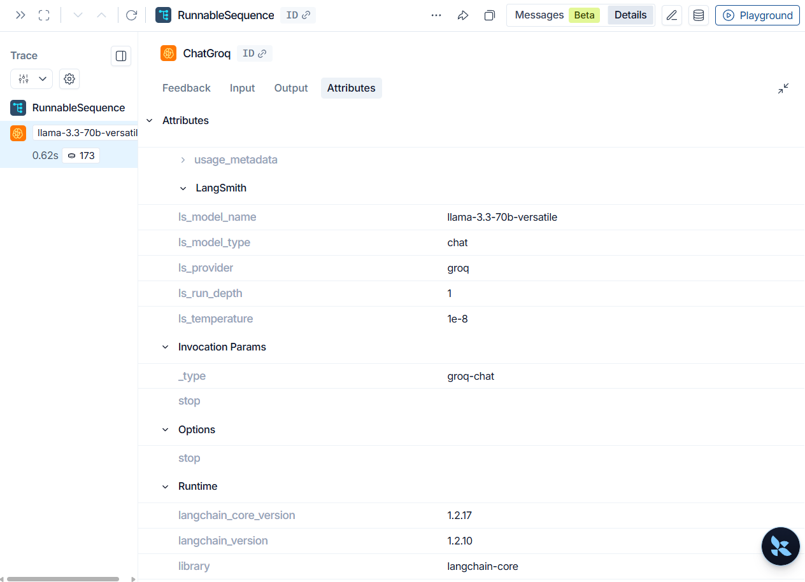

# LangSmith Tutorial: Tracing & Observability for LangChain Applications

This repository provides a practical introduction to **LangSmith**, the observability platform for LangChain applications. It demonstrates how to monitor, debug, and analyze LLM workflows using both **automatic** and **manual tracing**.

The notebook walks through the essential LangSmith features with simple, easy-to-understand examples that can be applied to real AI applications.

---

## What is LangSmith?

LangSmith is an observability and debugging platform designed for LLM applications. It helps developers understand what happens during model execution by recording every step of a chain or agent.

With LangSmith you can:

- Trace LangChain applications automatically
- Debug prompts and model outputs
- Monitor execution time
- Track token usage
- Inspect nested chain executions
- Capture errors and exceptions
- Analyze application behavior through an interactive dashboard

---

## Notebook Overview

The notebook covers the fundamentals of using LangSmith through several examples.

### 1. Setting Up LangSmith

- Configure the LangSmith API key
- Enable tracing
- Connect your application to the LangSmith dashboard

---

### 2. Automatic Tracing

Learn how LangSmith automatically traces LangChain components without requiring additional code.

The notebook demonstrates tracing for an LCEL chain built using:

- ChatPromptTemplate
- ChatGroq
- Output Parser

Every execution is automatically logged in LangSmith.

### Example Trace

The screenshots below show the trace produced by the chain—the run tree on the left and the input/output details on the right.

<p align="center">
    
    
</p>

---

### 3. Manual Tracing with `@traceable`

Not every function in an AI application belongs to LangChain.

This section demonstrates how to trace ordinary Python functions using the `@traceable` decorator.

Examples include:

- Custom Python functions
- Function inputs and outputs
- Nested function calls
- Execution timing

---

### 4. Tracing Errors

Observability becomes even more valuable when something goes wrong.

The notebook includes examples that intentionally raise exceptions so you can see how LangSmith records:

- Failed runs
- Exception messages
- Stack traces
- Execution metadata

---

## Technologies Used

- Python
- LangChain
- LangSmith
- Groq
- Jupyter Notebook

---

## Installation

Install the required packages:

```bash
pip install langchain
pip install langchain-groq
pip install langsmith
```

---

## Configuration

Set the required environment variables before running the notebook.

```python
import os

os.environ["LANGCHAIN_API_KEY"] = "YOUR_LANGSMITH_API_KEY"
os.environ["LANGCHAIN_TRACING_V2"] = "true"
os.environ["GROQ_API_KEY"] = "YOUR_GROQ_API_KEY"
```

---

## What You'll Learn

After completing this notebook, you'll know how to:

- Configure LangSmith
- Enable automatic tracing
- Trace LangChain chains
- Trace custom Python functions
- Inspect execution details
- Debug LLM applications
- Analyze failures and exceptions

---

## Repository Structure

```
.
├── langsmith.ipynb
├── README.md
└── images/
    ├── chain-trace.png
    ├── chain-details.png
    ├── traceable-example.png
    └── traceable-error.png
```

---

## Why Use LangSmith?

As LLM applications grow more complex, debugging becomes increasingly difficult. LangSmith provides visibility into every execution step, making it much easier to understand application behavior, diagnose issues, and improve performance.

Whether you're building simple chains or production-ready AI agents, LangSmith is an essential tool for development and monitoring.

---

## License

This project is released under the MIT License.