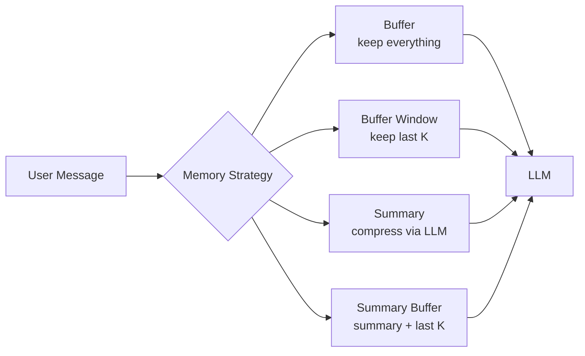
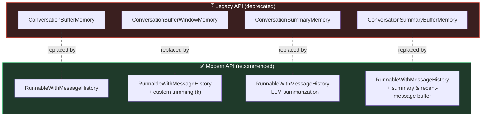
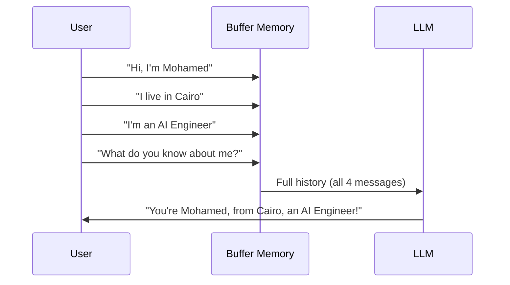
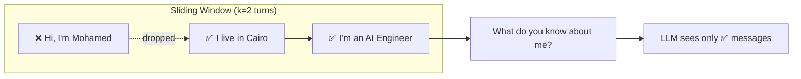
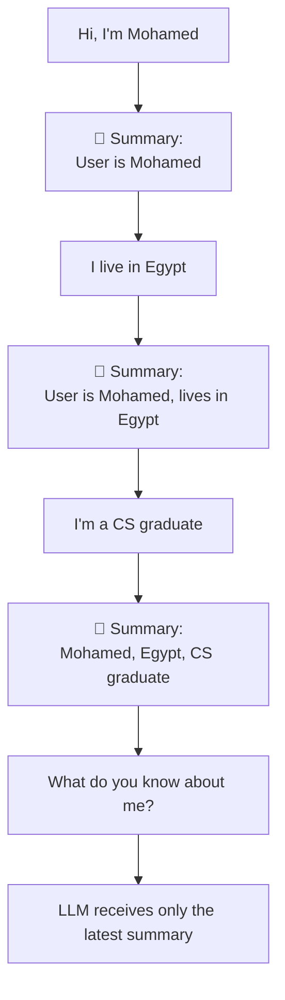
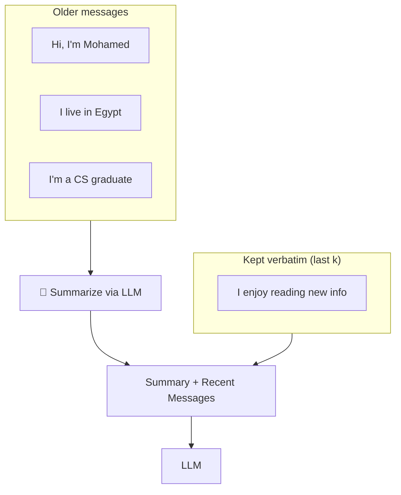
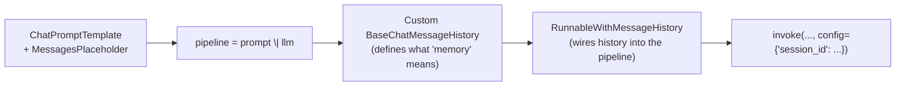

# 🧠 LangChain Memory Types — Legacy vs. Modern

A visual guide to conversational memory in LangChain: how each **legacy** memory class works, why it was deprecated, and what to use **instead** in modern LangChain apps.

> ⚠️ All memory classes below (`Conversation*Memory`) are **deprecated**. They're documented here for learning purposes and for maintaining older codebases. New projects should use `RunnableWithMessageHistory` (or LangGraph) instead.

---

## 🗺️ The Big Picture



---

## 🔄 Deprecation Map



All four modern replacements are built on the **same foundation** — `RunnableWithMessageHistory` — the difference is *how much history* gets passed to the model and *how* it's trimmed or compressed.

---

## 1️⃣ ConversationBufferMemory → `RunnableWithMessageHistory`

Stores the **entire conversation**, forever. Nothing is ever dropped.



| | |
|---|---|
| **Stores** | Entire conversation |
| **Token usage** | 📈 High, grows forever |
| **Best for** | Short chats, learning, debugging |
| **Risk** | Eventually exceeds the model's context window |
| **Replacement** | `RunnableWithMessageHistory` (unbounded `InMemoryChatMessageHistory`) |

---

## 2️⃣ ConversationBufferWindowMemory → `RunnableWithMessageHistory` + trimming

Keeps only the **last K messages** — older ones silently fall off.



| | |
|---|---|
| **Stores** | Last `k` conversation turns |
| **Token usage** | 📉 Low, fixed size |
| **Best for** | Support bots, short-context tasks |
| **Risk** | Forgets names/facts mentioned outside the window |
| **Replacement** | A custom `BaseChatMessageHistory` subclass that trims `self.messages` to the last `k` on every `add_messages()` call, plugged into `RunnableWithMessageHistory` via `ConfigurableFieldSpec` |

---

## 3️⃣ ConversationSummaryMemory → `RunnableWithMessageHistory` + summarization

Instead of storing raw messages, an **LLM call** rewrites a running summary every time.



| | |
|---|---|
| **Stores** | One continuously-updated summary |
| **Token usage** | 📉 Low, but costs an **extra LLM call** per turn |
| **Best for** | Long-running assistants where full history isn't needed |
| **Risk** | Summary can drop or distort details over time |
| **Replacement** | A custom `BaseChatMessageHistory` subclass whose `add_messages()` calls the LLM to regenerate a `SystemMessage` summary each time, wired into `RunnableWithMessageHistory` |

---

## 4️⃣ ConversationSummaryBufferMemory → `RunnableWithMessageHistory` + summary + window

The **hybrid**: old messages become a summary, recent messages stay verbatim.



| | |
|---|---|
| **Stores** | Summary (old) **+** raw messages (recent) |
| **Token usage** | ⚖️ Medium — balanced |
| **Best for** | Production chatbots needing both long-term & recent context |
| **Risk** | Most complex to implement/reason about |
| **Replacement** | A custom `BaseChatMessageHistory` subclass combining both strategies above: trims to the last `k` messages and folds anything older into a `SystemMessage` summary |

---

## 📊 Side-by-Side Comparison

| Memory Type | Stores | Token Usage | Extra LLM Calls? | Loses Info? |
|---|---|---|---|---|
| `ConversationBufferMemory` | Everything | 🔴 High (grows forever) | No | Never |
| `ConversationBufferWindowMemory` | Last `k` turns | 🟢 Low (fixed) | No | Yes, older messages |
| `ConversationSummaryMemory` | Running summary | 🟢 Low | Yes, every turn | Yes, fine detail |
| `ConversationSummaryBufferMemory` | Summary + last `k` | 🟡 Medium | Yes, when window overflows | Only oldest detail |

---

## 🛠️ The One Pattern Behind All Modern Replacements

Regardless of which strategy you need, the modern approach always follows the same shape:



- **What differs** between the four modern examples is only the `BaseChatMessageHistory` subclass's `add_messages()` logic (keep all / keep last k / summarize / summarize + keep last k).
- **What stays the same** is the `ChatPromptTemplate` → `pipeline` → `RunnableWithMessageHistory` wiring.

---

## ⚙️ Requirements

```bash
pip install langchain langchain-core langchain-classic langchain-groq pydantic
```

```python
import os
os.environ["GROQ_API_KEY"] = "your-key-here"
```

---

## ✅ Recommendation

| If you need... | Use... |
|---|---|
| Simple prototyping, short chats | `RunnableWithMessageHistory` (unbounded) |
| Fixed, predictable memory cost | `RunnableWithMessageHistory` + trimming (`k`) |
| Long conversations, don't need exact wording | `RunnableWithMessageHistory` + summarization |
| Production apps needing both long-term + recent context | `RunnableWithMessageHistory` + summary + recent window |

**Never** start a new project with the legacy `Conversation*Memory` classes — they're kept only for maintaining old code.
