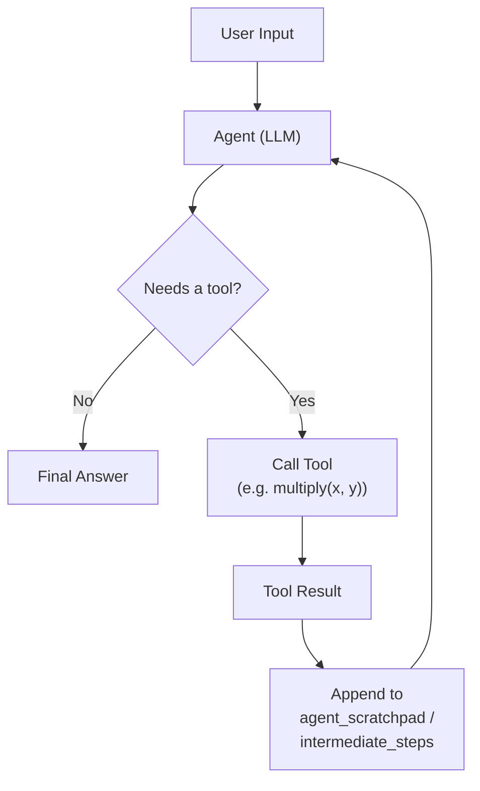
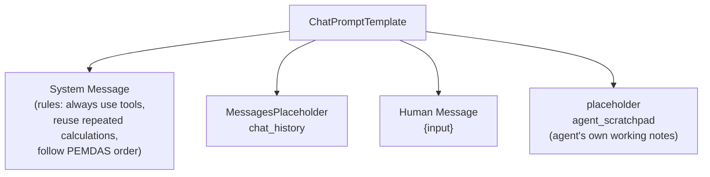
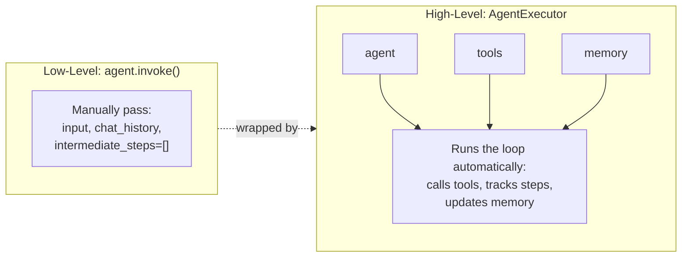
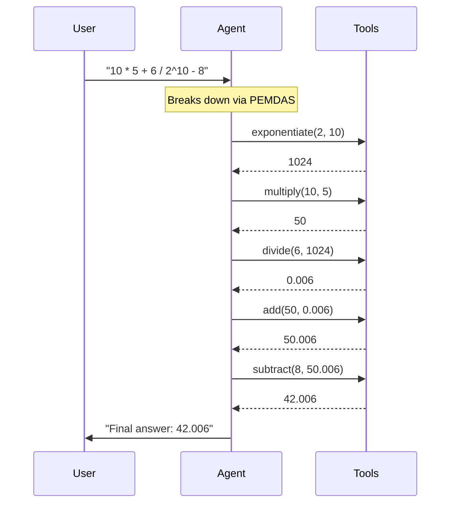
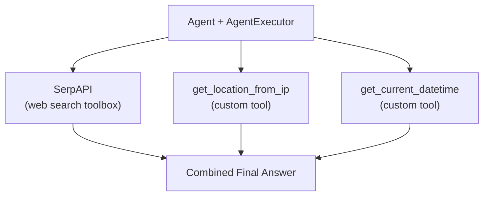
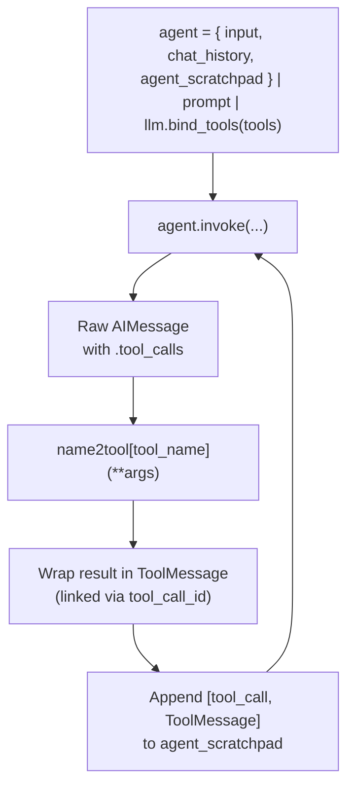
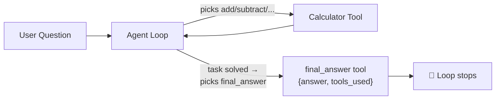
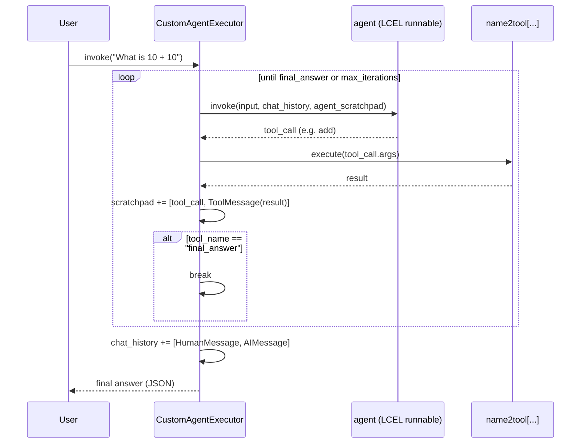

# 🤖 Intro to Agents — LangChain

A visual guide to how **agents** work in LangChain: how they decide to call tools, loop until a task is solved, and remember context across turns.

---

## 📖 Terminology

| Term | Definition |
|---|---|
| **Agent** | An LLM-driven system that can *decide* which action (tool) to take next, rather than only generating text in one shot. |
| **Tool** | A Python function exposed to the LLM (via `@tool`) so it can be "called" as part of solving a task — e.g. a calculator, a web search, an API lookup. |
| **`@tool` decorator** | Wraps a plain function so LangChain can expose its name, docstring, and argument schema to the LLM. The **docstring is the tool's description** — it's what the model reads to decide when/how to use it. |
| **`args_schema`** | An auto-generated Pydantic schema (from the function's type hints) describing exactly what arguments a tool expects. This is what gets sent to the LLM as the tool's calling contract. |
| **Tool call** | The LLM's structured request to invoke a specific tool with specific arguments — returned as JSON, then parsed and executed by LangChain. |
| **`agent_scratchpad`** | A special placeholder in the prompt where the agent's *own* intermediate steps (which tools it called, and their results) get logged during a single turn, so it can reason about what it's already done. |
| **`intermediate_steps`** | The list of (tool call, tool result) pairs accumulated so far in the current agent run — the raw data behind the `agent_scratchpad`. |
| **`create_tool_calling_agent`** | The LangChain function that binds an LLM + a list of tools + a prompt into an agent capable of choosing tools. |
| **`AgentExecutor`** | The runtime loop that actually *executes* an agent's chosen tool calls, feeds results back to the agent, repeats until done, and (optionally) manages conversation memory. |
| **`ConversationBufferMemory`** | (Legacy) Stores the full chat history and injects it into the prompt via `chat_history` — see the *Memory Types* notebook for details and modern alternatives. |
| **Toolbox / `load_tools`** | A LangChain helper that loads ready-made, pre-built tools (like SerpAPI web search) without writing them from scratch. |
| **Custom tool** | Any user-defined `@tool` function — here, one that geolocates via IP and one that returns the current date/time, since an LLM cannot know either on its own. |
| **`bind_tools()`** | Attaches a list of tools directly to an LLM object (LCEL-style), so the raw model output includes structured tool calls — without needing `create_tool_calling_agent`. |
| **`tool_choice`** | Controls how strongly the model is pushed to call a tool: `"any"` forces a tool call every time, `"auto"` lets the model decide freely between a tool call or a plain-text reply. |
| **`ToolMessage`** | A message type that carries a tool's output back into the conversation, linked to the original request via `tool_call_id` — this is how a tool's result gets "shown" to the model. |
| **`final_answer` tool** | A dedicated, user-defined tool whose only job is to package the final natural-language answer. Making the final response *itself* a tool call keeps every agent output in one consistent, parseable format. |
| **`CustomAgentExecutor`** | A hand-written Python class that reimplements `AgentExecutor`'s loop from scratch: call the agent → run the chosen tool → append the result to the scratchpad → repeat until `final_answer` is called or `max_iterations` is hit. |

---

## 🔁 The Agent Loop



The agent doesn't answer in one shot — it can loop: call a tool, look at the result, decide if another tool call is needed, and only stop once the task is fully resolved.

---

## 🧩 Anatomy of the Agent Prompt



- **System message** — sets hard rules (e.g. *always* call the tool for math, even `1+1`; reuse identical prior calculations; break expressions down via PEMDAS).
- **`chat_history`** — past user/AI turns, supplied by memory.
- **`{input}`** — the current user message.
- **`agent_scratchpad`** — required by every tool-calling agent; this is where its own tool calls & results for *this turn* get inserted before it produces a final answer.

---

## ⚙️ From Raw Agent → `AgentExecutor`



Calling the agent directly (`agent.invoke(...)`) means you manage `chat_history` and `intermediate_steps` by hand. `AgentExecutor` wraps that into one clean `.invoke({"input": ...})` call — it also owns the memory object, so history updates automatically after every turn.

---

## 🧮 Multi-Step Arithmetic Example



Because the system prompt mandates **one tool call per operation**, the agent chains several tool calls together, using each result as the input to the next — instead of silently doing the math itself.

---

## 🌐 Multi-Tool Agent Architecture



A single agent can mix **built-in** tools (loaded via `load_tools(["serpapi"])`) with **custom** tools (`@tool`-decorated functions) — here, answering "what's the weather where I am, right now?" requires location + time + a live search, all orchestrated automatically.

---

## 📊 Two Agents in This Notebook

| | Calculator Agent | Multi-Tool Agent |
|---|---|---|
| **Tools** | `add`, `subtract`, `multiply`, `divide`, `exponentiate` | SerpAPI search, IP-geolocation, current date/time |
| **Memory** | ✅ `ConversationBufferMemory` (`chat_history`) | ❌ None (stateless) |
| **Prompt complexity** | High — strict PEMDAS + tool-reuse rules | Simple — just input + scratchpad |
| **Best for** | Demonstrating precise, rule-driven tool orchestration | Demonstrating real-world, multi-source information gathering |

---

## 🔧 Building an Agent from Scratch (LCEL)

`create_tool_calling_agent` + `AgentExecutor` hide the mechanics of the loop. This section rebuilds the exact same behavior manually, one LCEL step at a time:



- **`tool_choice=\"any\"`** forces a tool call every time (useful while testing the mechanics).
- **`tool_choice=\"auto\"`** lets the model freely decide once results are available.
- The **`name2tool`** dict (`{tool.name: tool.func}`) is how the raw tool call gets turned into an actual function execution.

### Making the Final Answer a Tool Too



Rather than letting the model reply with free text, `final_answer` is defined as *just another tool*. This means **every** agent turn — intermediate or final — is a structured, parseable tool call, with nothing left to guess about the output format.

---

## 🔁 `CustomAgentExecutor` — Reimplementing the Loop by Hand



This class is a minimal, transparent version of what `AgentExecutor` does internally — useful for understanding (and customizing) exactly how tool-calling agents iterate, track state, and know when to stop.

| | `AgentExecutor` (built-in) | `CustomAgentExecutor` (from scratch) |
|---|---|---|
| **Loop control** | Handled internally | Explicit `while count < max_iterations` |
| **Stopping condition** | Model stops calling tools | Model calls the dedicated `final_answer` tool |
| **Memory** | Via `ConversationBufferMemory` | Manual `self.chat_history` list |
| **Transparency** | Black box (unless `verbose=True`) | Every step is visible in your own code |

---

## ⚙️ Requirements

```bash
pip install langchain langchain-core langchain-classic langchain-groq google-search-results requests
```

```python
import os
os.environ["GROQ_API_KEY"] = "your-groq-key"
os.environ["SERPAPI_API_KEY"] = "your-serpapi-key"
```

---

## ✅ Key Takeaway

An agent is just an LLM wrapped in a **loop**: it looks at the input and its own scratchpad, decides whether a tool call is needed, executes it via `AgentExecutor`, feeds the result back in, and repeats — until it can give a final, fully-resolved answer.
