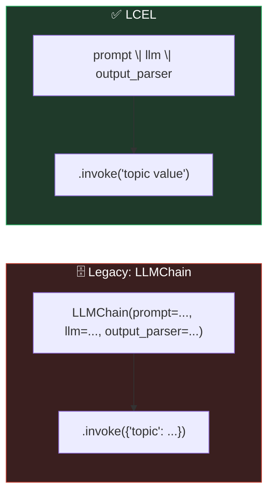
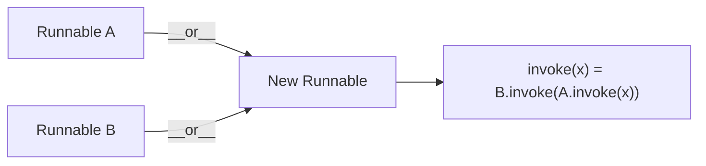
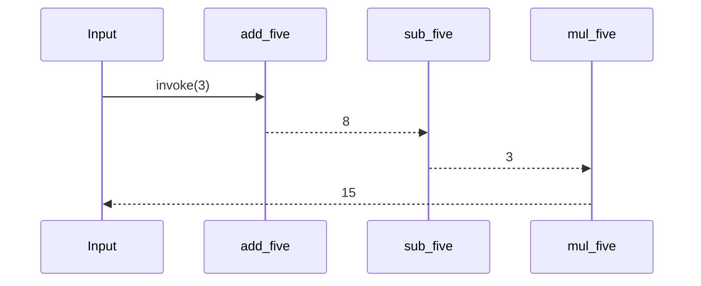
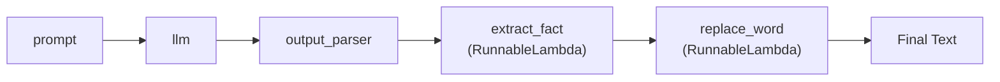
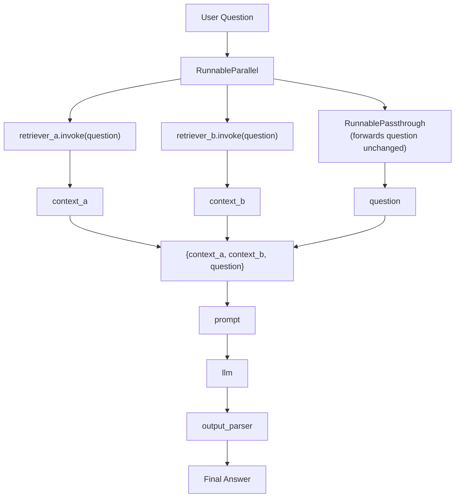

# 🔗 LCEL — LangChain Expression Language

A visual guide to LCEL: how the `|` pipe operator works, why it replaced the old `Chain` classes, and how to build custom pipelines with it.

---

## 📖 Terminology

| Term | Definition |
|---|---|
| **LCEL** | LangChain Expression Language — a declarative syntax (`|`) for composing prompts, models, parsers, and custom logic into a single pipeline. |
| **`PromptTemplate`** | Turns a string with `{placeholders}` into a reusable, fillable prompt. |
| **`LLMChain`** *(legacy)* | The pre-LCEL way to bundle a prompt + LLM + output parser into one object with an `.invoke()` method. |
| **`StrOutputParser`** | Extracts the plain-text `.content` from an LLM's raw `AIMessage` response, discarding metadata. |
| **`Runnable`** | The base interface behind *everything* in LCEL — anything with `.invoke()` and an overloaded `\|` operator can be chained: prompts, LLMs, parsers, even plain functions. |
| **`__or__`** | The Python "dunder" method behind the `\|` operator. Overloading it is what lets `a \| b` mean "run `a`, then feed its output into `b`" instead of "bitwise OR". |
| **`RunnableLambda`** | Wraps any plain Python function so it becomes a `Runnable` and can be piped (`\|`) together with everything else in a chain. |
| **`RunnableParallel`** | Runs multiple runnables **at the same time** on the same input, returning a dict of their combined results (e.g. querying two retrievers simultaneously). |
| **`RunnablePassthrough`** | A no-op runnable that forwards its input unchanged — useful inside a `RunnableParallel` to keep the original input (e.g. the user's question) alongside computed values (e.g. retrieved context). |
| **Vector store / Retriever** | A database of embedded text chunks that can be searched by semantic similarity; `.as_retriever()` turns it into a `Runnable` that takes a query and returns relevant documents. |
| **RAG (Retrieval-Augmented Generation)** | Retrieving relevant context and injecting it into the prompt before generation, so the model answers using real, retrieved facts. |

---

## ⚖️ Legacy `LLMChain` vs. LCEL



Same three components (prompt, model, parser) — LCEL just connects them directly with `|` instead of wrapping them in a `Chain` class.

---

## ⚙️ What `|` Actually Does





`chain = add_five | sub_five | mul_five` is equivalent to writing `mul_five(sub_five(add_five(3)))` — but declaratively, left to right, and reusable as a single object.

**Two ways to get a `Runnable`:**
- Build one yourself (override `__or__` and `.invoke()`)
- Wrap a plain function with `RunnableLambda` (what LangChain actually uses internally)

---

## 🧱 Extending a Pipeline with Custom Steps



Because every step is just a `Runnable`, **any** Python function can be dropped into the middle or end of a chain — post-processing, filtering, formatting — as long as it's wrapped in `RunnableLambda`.

---

## 🔀 RAG with Parallel Retrieval



`RunnableParallel` fires both retrievers **at the same time** rather than sequentially, and `RunnablePassthrough` makes sure the original question survives alongside the two retrieved contexts — all three land together in one dict, ready to fill the prompt's placeholders.

---

## 📊 Chain Evolution in This Notebook

| Stage | Chain | What's New |
|---|---|---|
| 1 | `LLMChain(prompt, llm, output_parser)` | Legacy baseline |
| 2 | `prompt \| llm \| output_parser` | Same result, LCEL syntax |
| 3 | `add_five \| sub_five \| mul_five` | Custom `Runnable` / `RunnableLambda` mechanics |
| 4 | `prompt \| llm \| output_parser \| extract_fact \| replace_word` | Post-processing steps appended |
| 5 | `RunnableParallel(...) \| prompt \| llm \| output_parser` | Parallel retrieval feeding a RAG prompt |

---

## ⚙️ Requirements

```bash
pip install langchain langchain-core langchain-classic langchain-groq langchain-huggingface langchain-community docarray
```

```python
import os
os.environ["GROQ_API_KEY"] = "your-groq-key"
```

---

## ✅ Key Takeaway

LCEL isn't a new concept — it's Python's `|` operator overloaded so that **anything** with `.invoke()` (prompts, models, parsers, retrievers, or your own functions wrapped in `RunnableLambda`) can be composed into one clean, declarative pipeline, run sequentially or in parallel.
