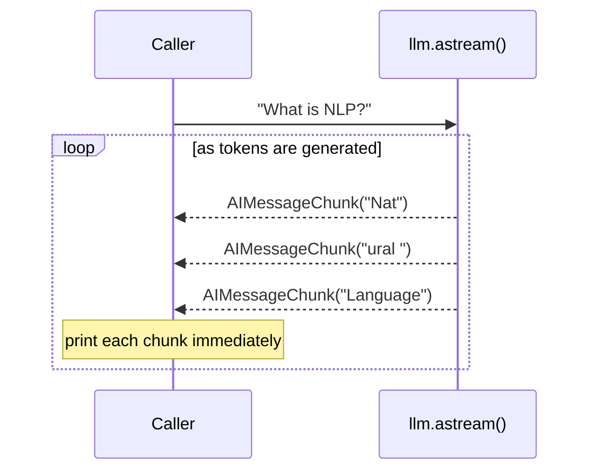
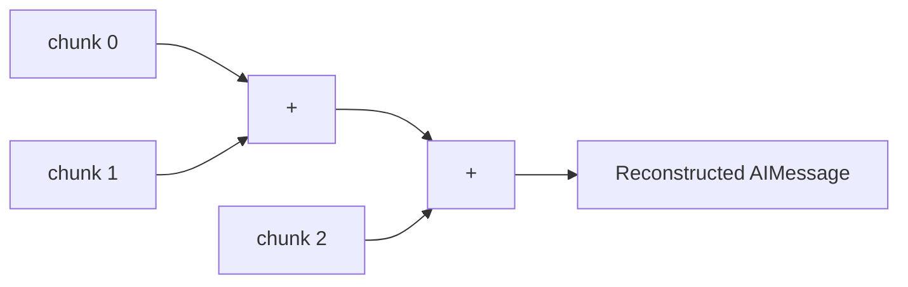
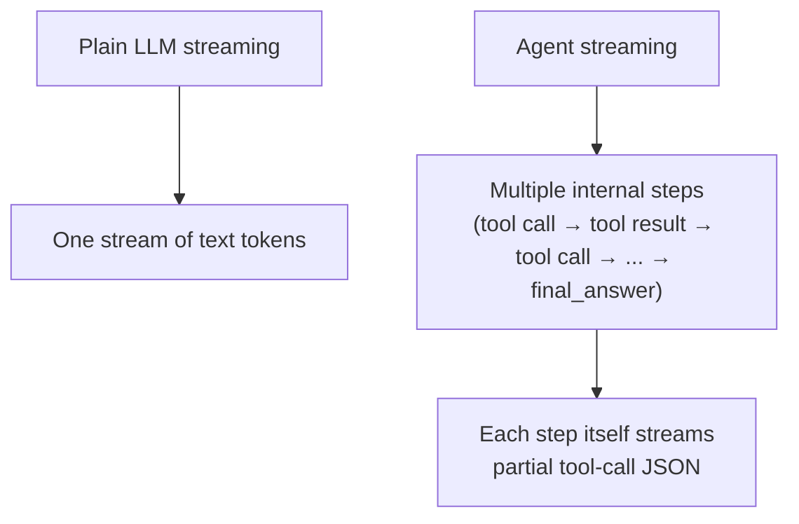
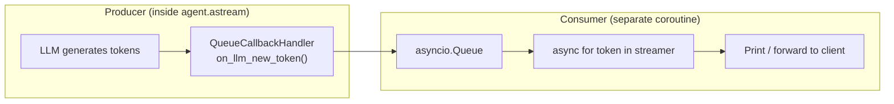
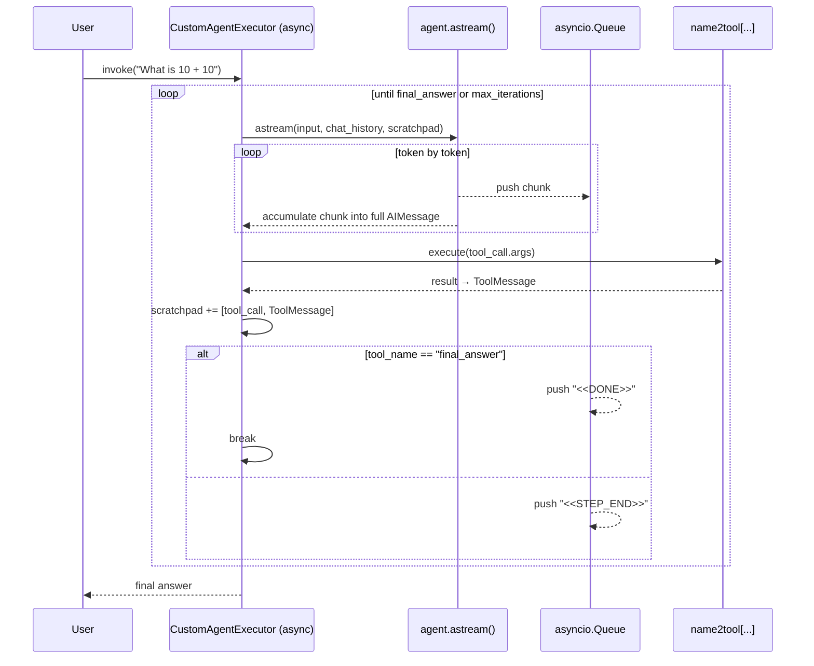

# 📡 Streaming — LangChain

A visual guide to streaming in LangChain: getting tokens as they're generated, and streaming from a full tool-calling **agent** — not just a plain LLM call.

---

## 📖 Terminology

| Term | Definition |
|---|---|
| **Streaming** | Receiving a model's response **incrementally**, piece by piece, as it's generated — instead of waiting for the entire output before seeing anything. |
| **`.astream()`** | The async method that turns an LLM call into a generator yielding partial results (chunks) one at a time. |
| **`AIMessageChunk`** | A partial piece of an `AIMessage`, yielded by `.astream()`. Consecutive chunks can be added together (`+`) — **in order** — to reconstruct the full message. |
| **Token** | The smallest unit of streamed output — LangChain also uses this term loosely for "one streamed chunk," whether that's a sub-word piece or a small JSON fragment of a tool call. |
| **`ConfigurableField`** | Marks a model parameter (e.g. `callbacks`) as swappable **at invocation time**, rather than fixed when the model object is first created. |
| **Callback / `AsyncCallbackHandler`** | A hook LangChain calls at specific lifecycle events (`on_llm_new_token`, `on_llm_end`, ...) — the mechanism used to intercept streamed tokens as they're produced. |
| **`QueueCallbackHandler`** *(custom)* | A callback handler that pushes every streamed token into an `asyncio.Queue`, so another part of the program can consume tokens in real time from a separate coroutine. |
| **`asyncio.Queue`** | A thread/coroutine-safe queue used here to pass tokens from the callback (producer) to the consumer loop (`async for token in streamer`). |
| **`<<STEP_END>>` / `<<DONE>>`** *(custom sentinels)* | Marker strings pushed into the queue to signal "one tool-calling step just finished" vs. "the entire agent run is complete" (i.e. the `final_answer` tool was called). |
| **`CustomAgentExecutor`** | The hand-built agent loop (from the agents notebook) — here extended into an **async, streaming** version that emits tokens as the agent thinks, instead of only returning a final result. |
| **`asyncio.create_task()`** | Schedules a coroutine (like the agent executor) to run **concurrently** in the background, so its output can be consumed live while it's still running — the same pattern a real streaming API endpoint would use. |

---

## 🔤 Streaming a Plain LLM Call





`+` on `AIMessageChunk` objects **only works correctly in the original order** — chunks encode "the next piece after what came before," so summing them out of order produces garbled or incorrect content.

---

## ⚙️ Why Streaming an Agent Is Harder



An agent doesn't produce one continuous stream — it runs a **loop** of steps, and each step is its own mini-stream of tokens that need to be reassembled into a tool call before the next step can execute.

---

## 🧵 The Callback → Queue → Consumer Pipeline



The callback handler is the **producer**: every time the LLM emits a token, `on_llm_new_token()` fires and pushes it into the queue. A separate `async for` loop is the **consumer**, pulling tokens out and displaying (or forwarding) them — decoupled from the agent's own execution.

---

## 🔁 Full Streaming Agent Loop



Meanwhile, a separate consumer can run **at the same time** via `asyncio.create_task(...)`, printing tokens as `Q` receives them — exactly how a real streaming API (e.g. Server-Sent Events) would forward output to a live client.

---

## 📊 Streaming Progression in This Notebook

| Stage | What's New |
|---|---|
| 1. `llm.astream(...)` | Basic token streaming from a single LLM call |
| 2. `CustomAgentExecutor` (sync) | A working tool-calling agent — but no streaming yet |
| 3. `ConfigurableField(callbacks=...)` | Makes the LLM's callbacks swappable per call |
| 4. `QueueCallbackHandler` | Captures streamed tokens into an `asyncio.Queue` |
| 5. `CustomAgentExecutor` (async) | Streams every step, reassembles chunks, executes tools, tracks `<<STEP_END>>` / `<<DONE>>` |
| 6. Concurrent consumption | Runs the executor as a background task while streaming tokens live to the console |

---

## ⚙️ Requirements

```bash
pip install langchain langchain-core langchain-groq
```

```python
import os
os.environ["GROQ_API_KEY"] = "your-groq-key"
```

---

## ✅ Key Takeaway

Streaming a plain LLM call just means consuming `.astream()` chunk by chunk. Streaming an **agent** means layering a callback handler + queue on top, so tokens from *every* internal tool-calling step can be captured, reassembled, and forwarded to a consumer in real time — while the agent's own loop keeps running underneath, unaware that anyone is watching.
