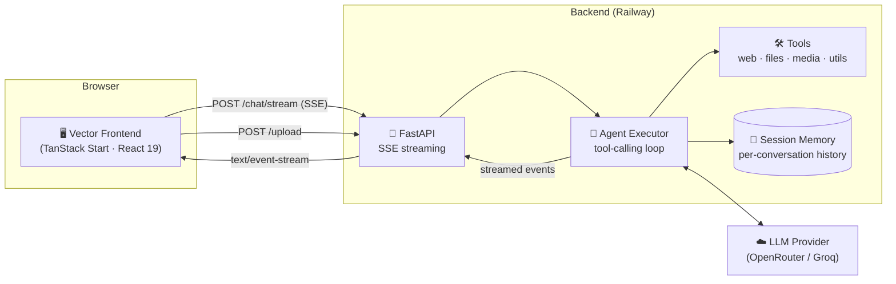

<div align="center">

# ⚡ VECTOR

### An AI operating system for getting things done — chat, files, tools, all in one interface.

[](./vector-backend)
[](./vector-frontend)
[](https://railway.app)
[](https://vercel.com)
[](#-license)

**[Live App](https://vector-ai-snowy.vercel.app)** · **[Backend README](./vector-backend/README.md)** · **[Frontend README](./vector-frontend/README.md)**

</div>

---

## 📖 What is this?

**Vector** is a full-stack, tool-using AI assistant. Unlike a plain chatbot, Vector can actually *do* things — search the web, read your files, generate images, transcribe YouTube videos, write code, and more — by reasoning step-by-step and calling real backend tools, then streaming its thought process and answer back to you live.

It's built as two independent services that talk to each other over HTTP:

<div align="center">



</div>

## 🗂️ Repository structure

```
langchain-projects/
├── chapters/                       # unrelated content — not part of Vector
└── vector-personal-assistant/
    ├── vector-backend/             # FastAPI + agent + tools  → see its own README
    │   ├── api.py
    │   ├── agent.py
    │   ├── tools/
    │   ├── memory/
    │   ├── Dockerfile
    │   └── requirements.txt
    │
    └── vector-frontend/            # TanStack Start UI        → see its own README
        ├── src/
        │   ├── components/vector/
        │   ├── lib/agent-client.ts
        │   └── routes/
        └── package.json
```

## ✨ Core capabilities

| Category | What it does |
|---|---|
| 🌐 **Web** | Live search (SerpAPI), webpage fetching, Wikipedia lookups |
| 📄 **Files** | Read & summarize PDF, DOCX, XLSX, CSV, TXT — with automatic OCR fallback (English + Arabic) for scanned documents |
| 🖼️ **Images** | AI image generation, OCR text extraction from screenshots/photos |
| 🎬 **YouTube** | Search videos, pull full transcripts + metadata |
| 🧮 **Utilities** | Calculator, unit/currency conversion, live weather, UUID generation, current date/time |
| 💻 **Code** | Writes code snippets on request |
| 💬 **Memory** | Each conversation keeps its own rolling history via a `session_id` |

## 🚀 Quick start

Each service is deployed and configured independently — see the dedicated README for full setup:

- 🔧 **[`vector-backend/README.md`](./vector-backend/README.md)** — environment variables, running locally, Docker, deploying to Railway
- 🎨 **[`vector-frontend/README.md`](./vector-frontend/README.md)** — running locally, connecting to the backend, deploying to Vercel

**TL;DR to run both locally:**

```bash
# Terminal 1 — backend
cd vector-personal-assistant/vector-backend
pip install -r requirements.txt
uvicorn api:app --reload --port 8000

# Terminal 2 — frontend
cd vector-personal-assistant/vector-frontend
npm install
npm run dev
```

## 🧰 Tech stack at a glance

<table>
<tr>
<td valign="top" width="50%">

**Backend**
- FastAPI + Uvicorn
- LangChain (custom async agent loop)
- OpenRouter / Groq (LLM providers)
- Tesseract OCR (eng + ara) + Poppler
- Docker, deployed on Railway

</td>
<td valign="top" width="50%">

**Frontend**
- TanStack Start (React 19 + Vite)
- TanStack Router & Query
- Tailwind CSS v4 + shadcn/ui (Radix)
- Server-Sent Events streaming client
- Deployed on Vercel

</td>
</tr>
</table>

## 👤 Author

Built by **Mohamed Waleed Elmasry** — [GitHub](https://github.com/Mohamed-Elmasry16)

## 📄 License

MIT — see [LICENSE](./LICENSE)
