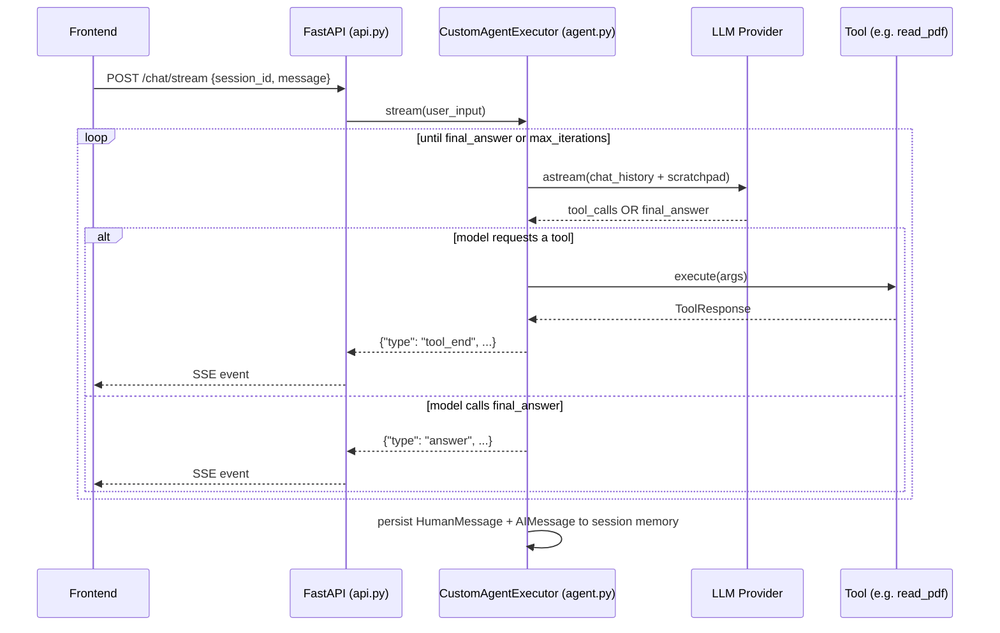

<div align="center">

# 🚀 Vector — Backend

### FastAPI + a custom streaming tool-calling agent

[](https://python.org)
[](https://fastapi.tiangolo.com)
[](https://langchain.com)
[](https://www.docker.com)
[](https://railway.app)

</div>

---

## 📑 Table of contents

- [What this service does](#-what-this-service-does)
- [Architecture](#-architecture)
- [Project structure](#-project-structure)
- [Environment variables](#-environment-variables)
- [Running locally](#-running-locally)
- [API reference](#-api-reference)
- [Available tools](#-available-tools)
- [Deployment (Railway)](#-deployment-railway)
- [Known limitations](#-known-limitations)
- [Troubleshooting](#-troubleshooting)

## 🧠 What this service does

This is Vector's brain. It exposes a small FastAPI app that:

1. Accepts a chat message + `session_id`
2. Runs a **custom async agent loop** (not LangChain's built-in `AgentExecutor` — a hand-rolled version tailored for streaming) that repeatedly calls an LLM, lets it choose real Python tools, executes them, and feeds results back
3. **Streams every step** — tool calls, tool results, and the final answer — back to the client live over Server-Sent Events
4. Persists each conversation's history to disk, keyed by `session_id`

## 🏗️ Architecture



## 📂 Project structure

```
vector-backend/
├── api.py                  # FastAPI app — /health, /chat/stream, /upload
├── agent.py                # CustomAgentExecutor — the streaming tool-calling loop
├── tools/
│   ├── basic_tools.py       # search, weather, calculator, image gen, code writer, etc.
│   └── file_tools.py        # PDF/DOCX/XLSX/CSV readers, OCR, YouTube, summarizer
├── memory/
│   └── memory.py            # per-session chat history (JSON on disk)
├── chat_sessions/           # session history storage (ephemeral on Railway free tier)
├── uploads/                 # uploaded files, saved per-session as UUID subfolders
├── Dockerfile
├── requirements.txt
└── railway.json              # optional — explicit Railway build config
```

## 🔑 Environment variables

Set these in your Railway service (**Settings → Variables**) or a local `.env` file. The app **fails to start** if any required key is missing.

| Variable | Required | Purpose |
|---|:---:|---|
| `OPENROUTER_API_KEY` | ✅ | LLM calls via OpenRouter (OpenAI-compatible endpoint) |
| `GROQ_API_KEY` | ✅ | Alternate/fallback LLM provider |
| `SERPAPI_API_KEY` | ✅ | Live web search tool |
| `YOUTUBE_API_KEY` | ✅ | YouTube search + video metadata |
| `HF_TOKEN` | ✅ | Hugging Face — used by image generation |
| `CORS_ORIGINS` | ✅ | Comma-separated list of allowed frontend origins, e.g. `https://vector-ai-snowy.vercel.app` |
| `PORT` | auto | Injected by Railway at runtime — don't set manually |

> ⚠️ **No trailing slashes, exact scheme match (`https://`).** A mismatched `CORS_ORIGINS` value is the #1 cause of "works locally, fails in prod."

## 💻 Running locally

```bash
# 1. Clone and enter the backend folder
cd vector-personal-assistant/vector-backend

# 2. Create a virtual environment
python3 -m venv venv
source venv/bin/activate          # Windows: venv\Scripts\activate

# 3. Install dependencies
pip install -r requirements.txt

# 4. System dependencies (OCR + PDF rendering) — skip if already installed
# macOS:   brew install tesseract tesseract-lang poppler
# Ubuntu:  sudo apt install tesseract-ocr tesseract-ocr-ara poppler-utils

# 5. Create a .env file with the variables listed above

# 6. Run it
uvicorn api:app --reload --port 8000
```

Or with Docker (identical to production):

```bash
docker build -t vector-backend .
docker run -p 8000:8000 --env-file .env vector-backend
```

Visit `http://localhost:8000/health` — you should see `{"status": "ok"}`.

## 📡 API reference

<details>
<summary><code>GET /health</code> — liveness check</summary>

```json
{ "status": "ok" }
```
</details>

<details>
<summary><code>POST /chat/stream</code> — send a message, get a live SSE stream back</summary>

**Request body:**
```json
{
  "session_id": "any-string-you-choose",
  "message": "what's the weather in Cairo?"
}
```

**Response:** `text/event-stream`, one JSON object per `data:` line. Event types:

| `type` | Meaning |
|---|---|
| `tool_start` | Model decided to call a tool — `{ "tool": "weather" }` |
| `tool_args_chunk` | Streaming pieces of the tool's arguments as the model generates them |
| `tool_end` | Tool finished — `{ "tool": "weather", "result": {...} }` (full result, including any base64 image data) |
| `answer_chunk` | A streaming piece of the final answer text |
| `answer` | The complete final answer |
| `error` | Something went wrong mid-turn (provider error, etc.) |
| `done` | Turn is complete — safe to close the stream |

</details>

<details>
<summary><code>POST /upload</code> — upload a file for the agent to read</summary>

`multipart/form-data` with fields:
- `session_id` — string
- `file` — the file itself

**Response:**
```json
{ "path": "/app/uploads/<uuid>/<uuid>_<original-filename>" }
```

Pass that `path` back in your next chat message (e.g. *"read this file: `<path>`"*) so the agent's file tools can pick it up. Files are read directly from disk by path — **not** base64-encoded over the wire.
</details>

## 🛠️ Available tools

<table>
<tr><th align="left">Tool</th><th align="left">Does</th></tr>
<tr><td><code>serpapi</code></td><td>Live web search</td></tr>
<tr><td><code>fetch_webpage</code></td><td>Fetch & extract a URL's content</td></tr>
<tr><td><code>wikipedia_search</code></td><td>Wikipedia lookups</td></tr>
<tr><td><code>generate_image</code></td><td>AI image generation</td></tr>
<tr><td><code>write_code</code></td><td>Generates code snippets</td></tr>
<tr><td><code>calculator</code></td><td>Math expression evaluation</td></tr>
<tr><td><code>currency_converter</code> / <code>unit_converter</code></td><td>Conversions</td></tr>
<tr><td><code>weather</code></td><td>Live weather by location</td></tr>
<tr><td><code>get_current_datetime</code> / <code>uuid_generator</code></td><td>Utilities</td></tr>
<tr><td><code>read_pdf</code> / <code>read_docx</code> / <code>read_csv</code> / <code>read_excel</code> / <code>read_file</code></td><td>Read an uploaded file by path (auto OCR fallback for scanned PDFs)</td></tr>
<tr><td><code>ocr_image</code></td><td>Extract text from an image (English + Arabic)</td></tr>
<tr><td><code>summarize_text</code></td><td>Summarize long text (paragraph/bullet, any language)</td></tr>
<tr><td><code>youtube_transcript</code> / <code>youtube_search</code></td><td>YouTube transcripts + video search</td></tr>
<tr><td><code>final_answer</code></td><td>How the model signals "I'm done, here's the reply"</td></tr>
</table>

## ☁️ Deployment (Railway)

1. **Root Directory**: point Railway at `vector-personal-assistant/vector-backend`
2. **Builder**: Dockerfile (`Dockerfile` in that folder)
3. Set all required env vars (table above) in **Variables**
4. Leave **Custom Start Command** empty — the `Dockerfile`'s `CMD` already handles `$PORT` correctly
5. Deploy — check `/health` on your public Railway URL once it's live

## ⚠️ Known limitations

- **Ephemeral disk**: `chat_sessions/` and `uploads/` do **not** persist across redeploys or restarts on Railway's free/hobby tiers. Conversation history and uploaded files reset. For real persistence, swap `memory/memory.py` to a database (e.g. Railway's free Postgres add-on).
- **Tool-calling reliability varies by model.** Not every model behind every provider reliably emits structured tool calls — some will "hallucinate" a plausible-looking tool call as plain text instead of a real one. If tools stop firing after a model swap, verify the new model explicitly supports function calling before assuming the code is broken.

## 🩺 Troubleshooting

| Symptom | Likely cause |
|---|---|
| CORS error in browser console | `CORS_ORIGINS` doesn't exactly match your frontend's origin, or Railway hasn't redeployed since you changed it |
| `Could not import module "api"` | Build context/`COPY` paths don't match where the code actually lives, or a Custom Start Command is overriding the Dockerfile's `CMD` |
| `Error: Invalid value for '--port': '$PORT'` | A Custom Start Command is set without shell expansion — clear it, or wrap it in `sh -c "..."` |
| Model responds but never calls tools | The selected model doesn't reliably support structured tool calling — try a different model/provider |
| File upload "works" but agent can't read it | Tool functions expect a path (current behavior) — make sure you're passing the exact path `/upload` returned, not re-uploading as base64 |
