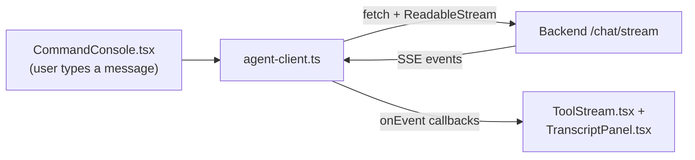

<div align="center">

# 🎨 Vector — Frontend

### The UI for Vector, built on TanStack Start

[](https://react.dev)
[](https://tanstack.com/start)
[](https://vitejs.dev)
[](https://tailwindcss.com)
[](https://vercel.com)

**[Live site →](https://vector-ai-snowy.vercel.app)**

</div>

---

## 📑 Table of contents

- [What this is](#-what-this-is)
- [Tech stack](#-tech-stack)
- [Project structure](#-project-structure)
- [Environment variables](#-environment-variables)
- [Running locally](#-running-locally)
- [How it talks to the backend](#-how-it-talks-to-the-backend)
- [Key components](#-key-components)
- [Deployment (Vercel)](#-deployment-vercel)
- [Troubleshooting](#-troubleshooting)

## 💡 What this is

The Vector frontend is a single-page interface for chatting with the [Vector backend](../vector-backend/README.md) — a streaming, tool-using AI agent. It renders the agent's reasoning live: which tool it's calling, arguments as they're generated, results, and the final answer, all as they stream in over Server-Sent Events.

## 🧰 Tech stack

| Layer | Choice |
|---|---|
| Framework | [TanStack Start](https://tanstack.com/start) (full-stack React, file-based routing via TanStack Router) |
| UI runtime | React 19 |
| Styling | Tailwind CSS v4 |
| Components | [shadcn/ui](https://ui.shadcn.com) on top of Radix UI primitives |
| Data/async | TanStack Query |
| Forms | react-hook-form + zod |
| Build | Vite 8 |
| Hosting | Vercel |

## 📂 Project structure

```
vector-frontend/
├── src/
│   ├── routes/                     # file-based routes (TanStack Router)
│   │   ├── __root.tsx
│   │   └── index.tsx                # main chat page
│   │
│   ├── components/
│   │   ├── ui/                      # shadcn/ui primitives (button, dialog, etc.)
│   │   └── vector/                  # Vector-specific UI
│   │       ├── VectorOS.tsx          # top-level app shell
│   │       ├── AiCore.tsx            # the animated "core" visual
│   │       ├── CommandConsole.tsx    # chat input / command bar
│   │       ├── ToolStream.tsx        # live tool-call activity feed
│   │       ├── TranscriptPanel.tsx   # conversation transcript
│   │       ├── ActivityPanel.tsx     # side activity/status panel
│   │       ├── FileCards.tsx         # uploaded file previews
│   │       ├── Sidebar.tsx           # navigation/session sidebar
│   │       └── ParticleField.tsx     # background particle effect
│   │
│   ├── hooks/
│   │   └── use-mobile.tsx
│   │
│   ├── lib/
│   │   └── agent-client.ts          # SSE streaming client for the backend API
│   │
│   ├── router.tsx
│   ├── server.ts
│   └── start.ts
│
├── .env.example
├── package.json
└── vite.config.ts
```

## 🔑 Environment variables

Copy `.env.example` to `.env` and fill in:

| Variable | Required | Example |
|---|:---:|---|
| `VITE_API_URL` | ✅ | `https://your-backend.up.railway.app` |

> ⚠️ **No trailing slash.** Also: Vite bakes this in **at build time** — changing it in Vercel's dashboard requires a fresh deployment (or a redeploy without build cache) to actually take effect, saving the variable alone does nothing to an already-built site.

## 💻 Running locally

```bash
cd vector-personal-assistant/vector-frontend

# 1. Install dependencies
npm install

# 2. Configure the backend URL
cp .env.example .env
# edit .env → VITE_API_URL=http://localhost:8000  (or your deployed backend)

# 3. Run the dev server
npm run dev
```

Other useful scripts:

```bash
npm run build      # production build
npm run preview    # preview the production build locally
npm run lint        # ESLint
npm run format      # Prettier
```

## 🔌 How it talks to the backend

All backend communication goes through `src/lib/agent-client.ts`, which:

1. Reads the backend base URL from `import.meta.env.VITE_API_URL` (falls back to `http://localhost:8000` if unset)
2. Sends chat messages to `POST /chat/stream` and manually reads the response body as a stream (a plain `EventSource` can't be used here since it only supports `GET`)
3. Parses each `data: {...}` line as it arrives and dispatches it by `type` (`tool_start`, `tool_args_chunk`, `tool_end`, `answer_chunk`, `answer`, `done`, `error`) so the UI can update live
4. Sends file uploads to `POST /upload` as `multipart/form-data`, then references the returned path in the next chat message



## 🧩 Key components

| Component | Role |
|---|---|
| `VectorOS.tsx` | Top-level shell that composes the whole app layout |
| `CommandConsole.tsx` | Where the user types messages and triggers uploads |
| `ToolStream.tsx` | Renders live "using {tool}..." activity as the agent works |
| `TranscriptPanel.tsx` | The actual chat conversation view |
| `FileCards.tsx` | Shows uploaded files as cards/previews |
| `Sidebar.tsx` | Session navigation |
| `AiCore.tsx` / `ParticleField.tsx` | Purely visual — the animated core + background effects that give Vector its look |

## ☁️ Deployment (Vercel)

1. Import the repo, set the **Root Directory** to `vector-personal-assistant/vector-frontend`
2. Add `VITE_API_URL` under **Settings → Environment Variables** (scope: Production + Preview as needed)
3. Deploy — Vercel auto-detects the Vite build
4. **After adding/changing `VITE_API_URL`, trigger a new deployment** (env var changes don't retroactively apply to an already-built deployment)
5. On the backend side, make sure `CORS_ORIGINS` includes this exact Vercel URL

## 🩺 Troubleshooting

| Symptom | Likely cause |
|---|---|
| Requests go to `localhost:8000` in production | `VITE_API_URL` not set on Vercel, or set but no rebuild happened since |
| Browser console shows a CORS error | Backend's `CORS_ORIGINS` doesn't include this exact frontend origin (check trailing slash, `http` vs `https`) |
| "Could not reach the agent API..." | Generic fetch-failure message — check Network tab for the actual status: CORS block vs. backend down vs. timeout |
| UI stuck / no streaming updates | Check the raw SSE response in Network tab — confirm `data:` lines are actually arriving and are valid JSON |
